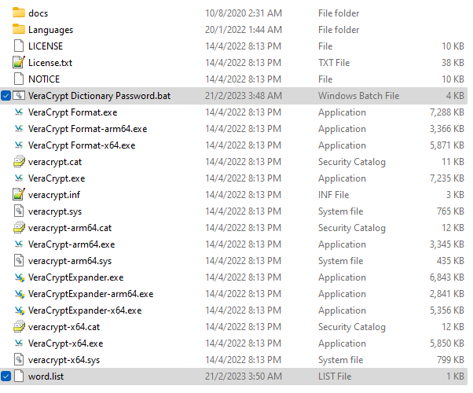
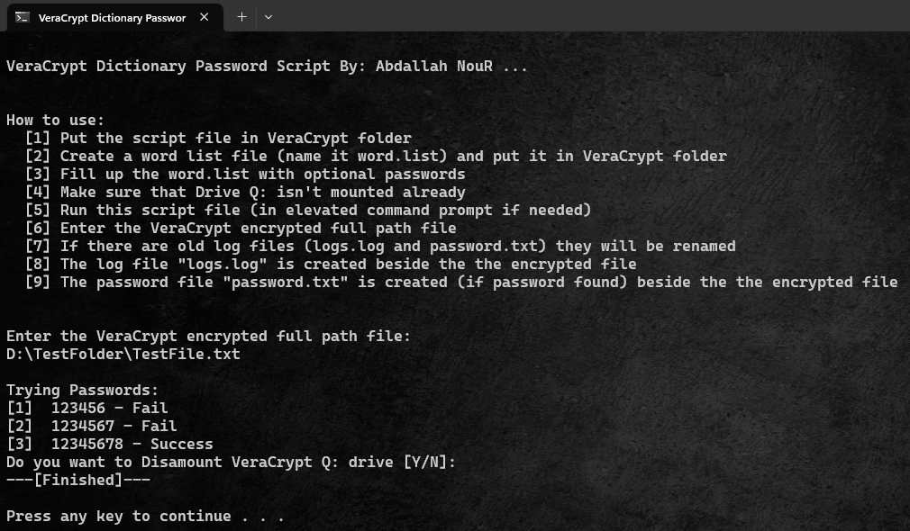

# VeraCrypt Dictionary Password Attack
This batch script performs a dictionary (or a brute-force) attack on VeraCrypt encrypted volume files.


VeraCrypt is a free and open-source utility for on-the-fly encryption. The software can create a virtual encrypted disk that works just like a regular disk but within a file.
You can download if from the <a href="https://www.veracrypt.fr/en/Downloads.html" target="_blank" rel="noopener noreferrer">**VeraCrypt Download Page**</a>.

## Usage
1. Put the script file `VeraCrypt Dictionary Password.bat` in VeraCrypt folder\
If you use an installer option, by default, it will be in `C:\Program Files\VeraCrypt`
2. Create a word list file (name it `word.list`) and put it in VeraCrypt folder

    <p style="text-align: center"></p>

3. Fill up the `word.list` with optional passwords\
You can generate as many as you wish, but it will take more time to try all of them\
Example:

    ````
    123456
    1234567
    12345678
    123456789
    password
    p@ssw0rd
    ````

4. Make sure that Drive **`Q:`** isn't mounted already
5. Run the script file `VeraCrypt Dictionary Password.bat`
6. Enter a valid VeraCrypt encrypted full path file and press `Enter`
   
   <p style="text-align: center"></p>

7. If there are old log files (`logs.log` and `password.txt`) they will be renamed
8. The log file `logs.log` is created beside the encrypted file
9. The password file `password.txt` is created (if the password had been founded) beside the encrypted file
    
        .
        ├── TestFile.txt    # Example of Encrypted File
        ├── logs.log        # Log file with all attempted passwords
        └── password.txt    # file with the right password if founded

## Features

* Save a log file with all the attempted passwords.
* Save a text file with the right password if it had been found.
* the `logs.log` file does not have any strings except the passwords so that you can compare it with `word.list` and delete the duplicated passwords then resume the attack from where you stopped
* Work fine in user mode command prompt
* Handle common input errors
* It doesn't require any programs other than VeraCrypt and CMD 

## Limitations

* The script can't distinguish between directory and extensionless file, so it will give an error
  - **Solution**: you can give any extension you want to the file as VeraCrypt doesn't care about extensions.
* It only works with `Q:` drive unless you change the drive letter in the code
* It can take a long time as it depends on the speed of VeraCrypt checking processes and the wordlist size
* Works only on Windows.

## Contributing

Feel free to contribute. Don't hesitate to refactor the current code base. This project is mainly built for educational and demonstration purposes, so verbose documentation is welcome.
